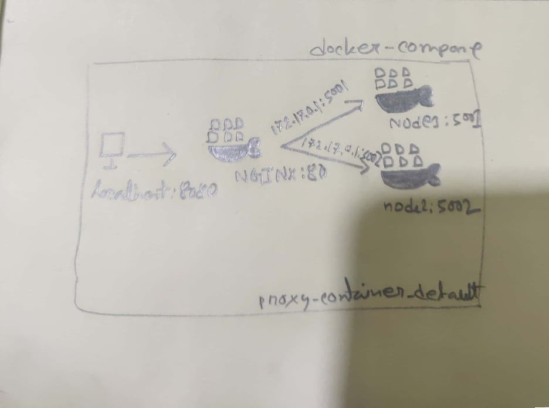

# Solution 1 (NGINX on host machine)

This solution used DockerFile and host nginx server to proxy service. Despite the first time configuration in host machine, it runs smoothly. However, this is not easyly shipable because of the configuration workload for each host machine.

# Solution 2 (Docker-compose)

Docker-compose solve the problem of above mentioned. Composing the whole solution needs only one command(docker-compose up) to bootstrap the system.Although compose use slightly complex internall networking, portabily of this has great resuabitly and easy setup.

# Requirements

* python3

* pip3 

* virtualenv

* Post installation steps for linux: https://docs.docker.com/engine/install/linux-postinstall/

* Install docker engine on ubuntu: https://docs.docker.com/engine/install/ubuntu/

# NGINX setup

* Change in local directory: sudo nano /etc/nginx/nginx.conf
* Reload nginx: sudo systemctl reload nginx
* Check status: sudo systemctl status nginx

# Setup

* Install docker-compose: sudo apt  install docker-compose
* Run:  docker-compose up

* docker build -t task . : Build the docker file
* docker run --rm -it -p 5000:5000 task : Run the docker Image from registry
* docker run -p 5000:5000 taskc -d : running in background
* docker ps: lists the containers that are still running. Add the -a switch in order to see containers that have stopped
* docker logs: retrieves the logs of a container, even when it has stopped
* docker inspect: gets detailed information about a running or stopped container
* docker stop: stops a container that is still running
* docker rm: deletes a container
* docker container prune -f: This is the equivalent of running one docker rm command for each stopped container.
* docker image ls : See the images available locally.

### Publish the docker image

* docker tag task sayemomer/task

* docker login

* docker push sayemomer/task

## Run Without docker

* create vertualenv : $ virtualenv venv --python=python3  
* active vertualenv : $ source venv/bin/activate
* install dependencies: $ pip3 install -r requirements.txt
* Start the server: $ python3 main.py

## Utility

* Check the process in a given port : sudo lsof -i :8080
* Kill process ID : sudo kill -9 13908

# Sample I/O

* Input: http://192.168.0.106:5000/calculate?task=2\nSun%2010%20May%202015%2013:54:36%20-0700\nSun%2010%20May%202015%2013:54:36%20-0000\nSat%2002%20May%202015%2019:54:36%20+0530\nFri%2001%20May%202015%2013:54:36%20-0000

* Output: [25200, 88200]

